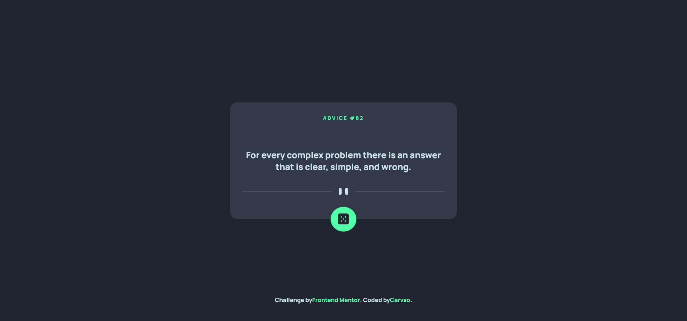

# Frontend Mentor - Advice generator app solution

This is a solution to the [Advice generator app challenge on Frontend Mentor](https://www.frontendmentor.io/challenges/advice-generator-app-QdUG-13db). Frontend Mentor challenges help you improve your coding skills by building realistic projects.

## Table of contents

- [Overview](#overview)
  - [The challenge](#the-challenge)
  - [Screenshot](#screenshot)
  - [Links](#links)
- [My process](#my-process)
  - [Built with](#built-with)
  - [What I learned](#what-i-learned)
- [Author](#author)

## Overview

### The challenge

Users should be able to:

- View the optimal layout for the app depending on their device's screen size
- See hover states for all interactive elements on the page
- Generate a new piece of advice by clicking the dice icon

### Screenshot



### Links

- Solution URL: [Add solution URL here](https://your-solution-url.com)
- Live Site URL: [Add live site URL here](https://your-live-site-url.com)

## My process

### Built with

- Semantic HTML5 markup
- CSS custom properties
- Flexbox
- Mobile-first workflow

### What I learned
I learned to fetch data from an API using fetch and handle the beauty of asynchronus JavaScript.
Threfore I learned to pay attention to the detail and just simply reproduce "as it is" a design, in order to increase my creativity when working on big projects.
Below i learned how to position a container to the centre of the page using absolute positioning.
```css
.container{
    display: flex;
    flex-direction: column;
    align-items: center;
    justify-content: center;
    position: absolute;
    top: 50%;
    left: 50%;
    transform: translate(-50%, -50%);
}
```
Here is the function i crafted to fetch the data from an API.
At first this API call gave me always the same object, but using this "query string" trick adding a ?t= and a random number it worked.
```js
async function dataFetch(url){
    const dataObject = await fetch(url);
    const dataJSON = await dataObject.json();
    return dataJSON;
}
const data = await dataFetch("https://api.adviceslip.com/advice?t=" + Math.random());
```
## Author

- Website - [Carvso](https://carvso.me)
- Frontend Mentor - [@carvso](https://www.frontendmentor.io/profile/carvso)
- Twitter - [@carvsoo](https://www.twitter.com/carvsoo)